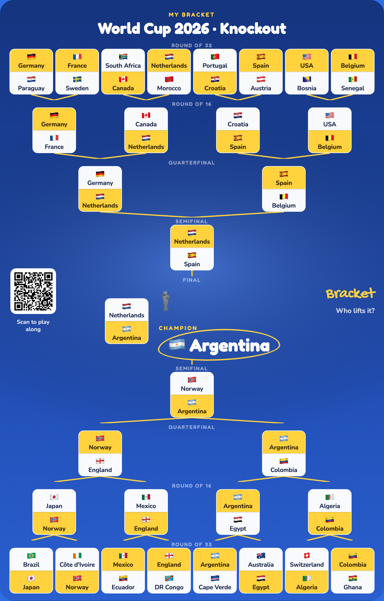

# Bracket Guess

Predict a knockout tournament round by round, light up your road to the trophy, and export a shareable poster — all in the browser, no backend.

**Live:** https://octopusgarage.github.io/bracket-guess/

<p align="center">
  
</p>

Seeded with the **2026 World Cup** 32-team knockout. Pick a winner for every fixture; each pick advances and lights the path to the centre, where the champion is crowned with the trophy. Save the result as a poster (with a QR code back to the app) to share.

## Features

- **Pick to the title** — a vertical, centre-converging bracket (8 / 16 / 32 teams) that doubles as the shareable poster.
- **Fixture cards** — every matchup is one card split by a halfway line, the winner's half lit; you always see which two teams play.
- **Poster export** — render the board to a full-resolution PNG. On phones it opens the native share sheet (Save Image → Photos); on desktop it downloads.
- **Four languages** — Chinese, English, Spanish, Japanese, including all team names; over-long names fall back to a broadcast short form.
- **Pure frontend** — picks are kept in `localStorage`; no accounts, no server.
- **Built to a quality floor** — responsive to mobile, visible focus, reduced-motion respected.

## Tech stack

React 18 · TypeScript · Vite · react-router-dom · react-i18next · html2canvas · qrcode · Vitest + Testing Library.

## Getting started

```bash
npm install
npm run dev       # http://localhost:5173/bracket-guess/
npm run build     # production build → dist/
npm test          # Vitest
npx tsc --noEmit  # type-check
```

## How it works

- **`src/lib/bracketMath.ts`** — pure, size-generic bracket logic: round/match derivation from the seeded teams, `prunePicks` (changing an earlier pick cascade-clears the picks it invalidated), champion detection, and the converging-band layout.
- **`src/hooks/useBracket.ts`** — pick state on top of that math, persisted via `useHistory` (`localStorage`).
- **`src/components/BracketBoard.tsx`** — renders the board at a fixed design width and scales it to fit the viewport, so it fills one screen on a phone while the exported PNG stays full-resolution.

## Add a tournament

The framework is data-driven — adding a tournament is data, not code:

1. Drop a JSON into `src/data/tournaments/` (copy `worldcup-2026.json`). Set `size` to `8`, `16`, or `32` and list the `teams` in seeded order (adjacent pairs are first-round fixtures). Each team carries `name` (`zh`/`en`, optional `es`/`ja`), an optional `short` name, and a flag.
2. Register it in `src/data/index.ts`.

## Internationalization

UI strings live in `src/locales/<lang>.json`; team and tournament names are localized inline in the tournament data. `src/i18n/lang.ts` resolves the active language and falls back to English for any missing translation.

## Deployment

Pushing to `main` triggers `.github/workflows/deploy.yml`, which builds and publishes `dist/` to GitHub Pages. The Vite `base` is `/bracket-guess/`.
